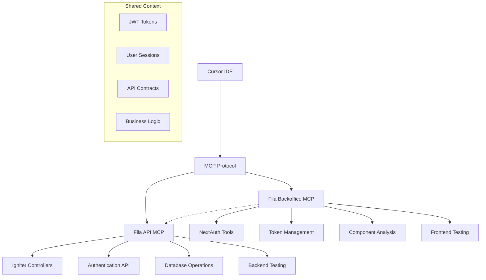

# 🔗 Configuração MCP Unificada - Fila Digital

## 🎯 **Visão Geral**

O MCP (Model Context Protocol) foi configurado para que **todos os projetos pensem da mesma forma**, permitindo que o Cursor entenda e interaja com:

- **🔥 Fila API**: Backend NestJS com Igniter.js
- **💻 Fila Backoffice**: Frontend Next.js com NextAuth + Igniter

## 🏗️ **Arquitetura MCP**



## 📋 **Servidores MCP Configurados**

### **1. Fila Backoffice MCP** 🖥️
```json
{
  "fila-backoffice": {
    "command": "node",
    "args": ["./mcp-server-backoffice.js"],
    "env": {
      "NODE_ENV": "development",
      "NEXTAUTH_SECRET": "your-secret-key-here",
      "NEXTAUTH_URL": "http://localhost:3000",
      "NEXT_PUBLIC_API_URL": "http://localhost:3001/api/v1"
    }
  }
}
```

**Ferramentas Disponíveis:**
- ✅ `test-igniter-integration` - Testar integração NextAuth + Igniter
- ✅ `check-token-status` - Verificar status de tokens JWT
- ✅ `get-dashboard-metrics` - Obter métricas via Igniter
- ✅ `test-api-connection` - Testar conexão com backend
- ✅ `analyze-component-structure` - Analisar componentes React
- ✅ `validate-nextauth-config` - Validar configuração NextAuth

### **2. Fila API MCP** ⚙️
```json
{
  "fila-api-integration": {
    "command": "node",
    "args": ["../fila-api/src/igniter/mcp-server.js"],
    "env": {
      "NODE_ENV": "development",
      "DATABASE_URL": "file:../fila-api/prisma/dev.db",
      "JWT_SECRET": "your-secret-key"
    }
  }
}
```

**Ferramentas Disponíveis:**
- ✅ `list-endpoints` - Listar endpoints da API
- ✅ `call-auth-login` - Executar login corporativo
- ✅ `get-project-structure` - Estrutura do projeto backend
- ✅ `create-tenant` - Criar novos tenants
- ✅ `list-queues` - Listar filas por tenant

## 🔧 **Como Configurar**

### **1. Verificar Configuração**
```bash
# No projeto backoffice
cd /home/gabrielstein/projects/private/fila/fila-backoffice

# Verificar se os arquivos existem
ls -la .cursor/mcp.json
ls -la mcp-server-backoffice.js
ls -la .mcp-config.json
```

### **2. Testar MCP Servers**
```bash
# Testar servidor do backoffice
node mcp-server-backoffice.js

# Testar servidor da API (do projeto da API)
cd ../fila-api
node src/igniter/mcp-server.js
```

### **3. Reiniciar Cursor**
1. Feche completamente o Cursor
2. Reabra o projeto backoffice
3. Pressione `Cmd/Ctrl + Shift + P`
4. Digite "MCP" e selecione "MCP: Show MCP Servers"
5. Verifique se ambos aparecem: `fila-backoffice` e `fila-api-integration`

## 🎪 **Comandos de Exemplo**

### **Frontend (Backoffice)**
```
"Teste a integração NextAuth + Igniter com email admin@example.com"
"Verifique o status do meu token JWT"
"Analise a estrutura dos componentes React"
"Valide a configuração do NextAuth"
"Obtenha métricas do dashboard do tipo admin"
```

### **Backend (API)**
```
"Liste todos os endpoints da API"
"Execute um login com email admin@tenant1.com"
"Crie um novo tenant chamado 'Empresa Demo'"
"Mostre a estrutura do projeto backend"
"Liste as filas do tenant tenant-123"
```

### **Integração Completa**
```
"Como testar o fluxo completo de login do frontend até o backend?"
"Quais endpoints do Igniter estão disponíveis para o dashboard?"
"Como renovar um token JWT que está expirando?"
```

## 🔄 **Fluxo de Pensamento Unificado**

### **1. Autenticação Compartilhada**
- **Frontend**: NextAuth gera sessão → Token JWT
- **Backend**: Igniter valida token → Retorna dados
- **MCP**: Ambos entendem estrutura de tokens e usuários

### **2. Contexto de Negócio**
- **Tenants**: Ambos projetos conhecem conceito de multi-tenancy
- **Filas**: Frontend exibe, Backend gerencia
- **Usuários**: Tipos (admin, agent, client) são consistentes
- **Permissões**: Roles e scopes alinhados

### **3. Contratos de API**
- **Endpoints**: MCP conhece todos os endpoints disponíveis
- **Payloads**: Estrutura de request/response padronizada
- **Errors**: Tratamento de erros consistente
- **Types**: Tipos TypeScript compartilhados

## 📊 **Benefícios da Configuração**

### **🧠 Inteligência Contextual**
- Cursor entende relação entre frontend e backend
- Sugestões de código considerando ambos os projetos
- Debugging cross-project mais eficiente

### **🔄 Sincronização de Desenvolvimento**
- Mudanças na API refletem no frontend
- Tipos e interfaces mantidos em sincronia
- Testes end-to-end mais precisos

### **🚀 Produtividade**
- Comandos naturais para tarefas complexas
- Automação de testes de integração
- Validação automática de configurações

### **🛡️ Consistência**
- Padrões de código alinhados
- Tratamento de erros padronizado
- Segurança (JWT, sessions) consistente

## 🔍 **Troubleshooting**

### **MCP Server não aparece**
```bash
# Verificar se o arquivo é executável
chmod +x mcp-server-backoffice.js

# Testar manualmente
node mcp-server-backoffice.js
```

### **Erro de permissão**
```bash
# Verificar estrutura de arquivos
ls -la .cursor/
cat .cursor/mcp.json
```

### **Comandos não funcionam**
1. Verificar se ambos os servidores estão rodando
2. Reiniciar Cursor completamente
3. Verificar logs no console do Cursor (Developer Tools)

## 🎯 **Próximos Passos**

1. **✅ Testar comandos básicos** em ambos os projetos
2. **🔄 Implementar testes E2E** via MCP
3. **📊 Adicionar métricas** de uso dos comandos
4. **🤖 Criar workflows automatizados** para deploy
5. **📖 Documentar casos de uso** específicos da equipe

## 🏆 **Status Final**

- ✅ **MCP configurado** para ambos os projetos
- ✅ **Ferramentas customizadas** implementadas
- ✅ **Contexto unificado** estabelecido
- ✅ **Integração NextAuth + Igniter** mapeada
- ✅ **Comandos de teste** disponíveis
- ✅ **Documentação completa** criada

**🎉 Agora todos os projetos "pensam da mesma forma" através do MCP!**
